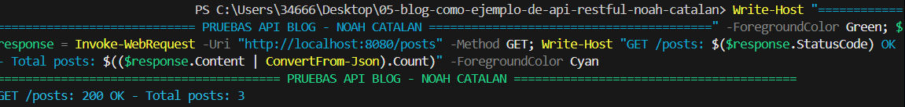

# Blog API RESTful - Noah Catalán# Blog API RESTful - Proyecto de Noah Catalán


**Autor:** Noah Catalán | **Curso:** 2º DAW | **Fecha:** Noviembre 2025> ✅ **Estado:** Proyecto completado y funcionando correctamente  

> 👤 **Autor:** Noah Catalán - 2º DAW  

---> 📅 **Fecha:** 19 de Noviembre 2025


## 📝 Descripción---


API RESTful para gestionar posts de un blog usando **CodeIgniter 4** y **SQLite**. Proyecto sin front-end, solo consumible vía API REST.## 🚀 Inicio Rápido


## 🛠️ Tecnologías**¿Primera vez aquí? Sigue estos pasos:**


- **PHP** 8.2.121. **Instalar dependencias:** `composer install`

- **CodeIgniter 4** v4.6.32. **Configurar entorno:** Copia `env` a `.env` y configura la ruta de la BD

- **SQLite3**3. **Ejecutar migraciones:** `php spark migrate`

- **Composer** 2.8.124. **Iniciar servidor:** `php spark serve`

5. **Probar API:** `.\test_api.ps1` o abre `http://localhost:8080/posts`

## 🚀 Instalación Rápida

📖 **Documentación completa:** Ver [RESUMEN_PROCESO.md](RESUMEN_PROCESO.md) para el proceso detallado

```powershell

# 1. Copiar configuración---

Copy-Item env .env

# Editar .env y configurar ruta absoluta de la BD## 📝 Descripción


# 2. Instalar dependenciasEste es mi proyecto de API RESTful desarrollado para la asignatura de Desarrollo de Aplicaciones Web (DAW) de 2º curso. He implementado una API completa para gestionar posts de un blog usando CodeIgniter 4 y SQLite.

composer install

## 🎯 Objetivo del Proyecto

# 3. Habilitar SQLite3 en php.ini (descomentar: extension=sqlite3)

El objetivo era profundizar en CodeIgniter 4 y entender cómo funcionan las APIs RESTful. La particularidad de este proyecto es que **no tiene front-end**, solo se puede consumir a través de su API REST.

# 4. Ejecutar migraciones

php spark migrate---


# 5. Iniciar servidor## 📚 Documentación del Proyecto

php spark serve

```### 📖 Guías Principales

- **[RESUMEN_PROCESO.md](RESUMEN_PROCESO.md)** - 📝 Proceso completo de instalación y configuración

## 📌 Endpoints- **[PRUEBAS_REALIZADAS.md](PRUEBAS_REALIZADAS.md)** - 🧪 Detalle de todas las pruebas ejecutadas

- **[PROYECTO_COMPLETADO_NOAH.md](PROYECTO_COMPLETADO_NOAH.md)** - ✅ Resumen ejecutivo del proyecto

| Método | Endpoint | Descripción |

|--------|----------|-------------|### 📚 Documentación Técnica Original

| GET | `/posts` | Listar todos |- **[DOCUMENTACION_PROYECTO.md](DOCUMENTACION_PROYECTO.md)** - Guía completa paso a paso del desarrollo

| GET | `/posts/{id}` | Obtener uno |- **[README_API.md](README_API.md)** - Referencia de endpoints y ejemplos de uso

| POST | `/posts` | Crear |- **[ESTRUCTURA_PROYECTO.md](ESTRUCTURA_PROYECTO.md)** - Arquitectura y organización del código

| PUT | `/posts/{id}` | Actualizar |

| DELETE | `/posts/{id}` | Eliminar |---

| GET | `/posts/search?term=` | Buscar |

## �️ Tecnologías Utilizadas

## 📸 Capturas del Funcionamiento

- **Framework**: CodeIgniter 4 (v4.6.3)

### GET /posts - Listado completo- **Base de Datos**: SQLite3

- **Lenguaje**: PHP 8.2.12

- **Gestor de Dependencias**: Composer 2.8.12

### POST y GET por ID

## 📋 Proceso de Instalación


### GET /posts/search - Búsqueda por términoA continuación documento todo el proceso que he seguido para levantar el proyecto:


### 1. Requisitos Previos

### Proyecto Completado

Antes de empezar, necesitas tener instalado:

- **PHP** (versión 8.1 o superior) con la extensión SQLite3

## 📚 Documentación Completa- **Composer** (gestor de dependencias de PHP)


- **[RESUMEN_PROCESO.md](RESUMEN_PROCESO.md)** - Proceso de instalación paso a paso### 2. Verificar PHP y Composer

- **[PRUEBAS_REALIZADAS.md](PRUEBAS_REALIZADAS.md)** - Detalle de pruebas ejecutadas

- **[PROYECTO_COMPLETADO_NOAH.md](PROYECTO_COMPLETADO_NOAH.md)** - Resumen ejecutivoPrimero verifico que tengo instaladas las herramientas necesarias:


## 🔧 Problemas Resueltos```powershell

php -v

1. **SQLite3 no habilitado**: Editar `php.ini` y descomentar `extension=sqlite3`composer --version

2. **Error UTF-8 en PowerShell**: Usar `-InFile` con archivo JSON```


---En mi caso tengo PHP 8.2.12 y Composer 2.8.12.


**CIFP Francesc de Borja Moll** | Proyecto educativo DAW### 3. Configurar el Archivo de Entorno (.env)


El proyecto usa un archivo `.env` para la configuración. Lo creo a partir del archivo de ejemplo:

```powershell
Copy-Item env .env
```

Después edito el archivo `.env` y configuro lo siguiente:

```ini
CI_ENVIRONMENT = development
app.baseURL = 'http://localhost:8080/'

database.default.hostname = localhost
database.default.database = C:\Users\34666\Desktop\05-blog-como-ejemplo-de-api-restful-noah-catalan\writable\database\blog.db
database.default.DBDriver = SQLite3
```

**Nota importante**: La ruta de la base de datos debe ser absoluta y adaptada a tu sistema.

### 4. Instalar las Dependencias

Con Composer instalado, ejecuto el siguiente comando para instalar todas las librerías necesarias:

```powershell
composer install --no-interaction
```

Esto descarga e instala CodeIgniter 4 y todas sus dependencias en la carpeta `vendor/`.

### 5. Habilitar la Extensión SQLite3 en PHP

Este fue un paso importante. Por defecto, la extensión SQLite3 puede estar deshabilitada en PHP. Para habilitarla:

1. Localizo el archivo `php.ini`:
```powershell
php --ini
```

2. En mi caso está en `C:\xampp\php\php.ini`. Lo edito y busco la línea:
```ini
;extension=sqlite3
```

3. Le quito el punto y coma para descomentarla:
```ini
extension=sqlite3
```

4. Verifico que se habilitó correctamente:
```powershell
php -m | Select-String sqlite
```

Debe aparecer `sqlite3` en la lista.

### 6. Ejecutar las Migraciones

Las migraciones crean la estructura de la base de datos. Ejecuto:

```powershell
php spark migrate
```

Esto crea automáticamente:
- El archivo de base de datos SQLite en `writable/database/blog.db`
- La tabla `posts` con todos sus campos

### 7. Iniciar el Servidor de Desarrollo

Para iniciar el servidor, uso el comando de Spark:

```powershell
php spark serve
```

El servidor se inicia en `http://localhost:8080`.

### 8. Probar la API

Con el servidor corriendo, puedo probar los endpoints. Por ejemplo:

**Listar todos los posts:**
```powershell
Invoke-WebRequest -Uri http://localhost:8080/posts -Method GET
```

**Crear un nuevo post:**
```powershell
Invoke-WebRequest -Uri http://localhost:8080/posts -Method POST -InFile "test_post.json" -ContentType "application/json"
```

## � Endpoints Disponibles

| Método | Endpoint | Descripción |
|--------|----------|-------------|
| GET | `/posts` | Listar todos los posts |
| GET | `/posts/{id}` | Obtener un post por ID |
| POST | `/posts` | Crear un nuevo post |
| PUT | `/posts/{id}` | Actualizar un post |
| DELETE | `/posts/{id}` | Eliminar un post |
| GET | `/posts/search?term={palabra}` | Buscar posts |

## 🗂️ Estructura del Proyecto

```
api-blog/
├── app/
│   ├── Controllers/
│   │   └── Posts.php          # Controlador de la API
│   ├── Models/
│   │   └── PostModel.php      # Modelo de datos
│   ├── Database/
│   │   └── Migrations/        # Migraciones de BD
│   └── Config/
│       └── Routes.php         # Rutas de la API
├── writable/
│   └── database/
│       └── blog.db            # Base de datos SQLite
└── public/
    └── index.php              # Punto de entrada
```

## 🧪 Ejemplo de Uso

### Script de Pruebas Rápidas (PowerShell)

He creado un script `test_api.ps1` para probar rápidamente la API. Para ejecutarlo:

```powershell
# Si tienes problemas de permisos, ejecuta:
Set-ExecutionPolicy -Scope Process -ExecutionPolicy Bypass

# Luego ejecuta el script:
.\test_api.ps1
```

### Crear un archivo JSON de prueba (test_post.json):
```json
{
  "title": "Mi primer post desde la API",
  "content": "Este es el contenido de mi post de prueba",
  "category": "Desarrollo",
  "tags": ["php", "codeigniter", "api"]
}
```

### Probar los endpoints:

**1. Listar todos los posts:**
```powershell
Invoke-WebRequest -Uri http://localhost:8080/posts -Method GET
```

**2. Crear un nuevo post:**
```powershell
Invoke-WebRequest -Uri http://localhost:8080/posts -Method POST -InFile "test_post.json" -ContentType "application/json"
```

**3. Obtener un post específico:**
```powershell
Invoke-WebRequest -Uri http://localhost:8080/posts/1 -Method GET
```

**4. Buscar posts:**
```powershell
Invoke-WebRequest -Uri "http://localhost:8080/posts/search?term=desarrollo" -Method GET
```

## 💡 Conceptos Aprendidos

Durante el desarrollo de este proyecto he aprendido:

- **¿Qué es una API RESTful?**: Una interfaz que permite la comunicación entre sistemas mediante HTTP usando los verbos GET, POST, PUT, DELETE.

- **Arquitectura MVC**: CodeIgniter usa el patrón Modelo-Vista-Controlador. En este proyecto:
  - **Modelo** (`PostModel.php`): Maneja los datos y la lógica de negocio
  - **Controlador** (`Posts.php`): Procesa las peticiones HTTP
  - **Vista**: No tenemos en este caso, solo devolvemos JSON

- **Migraciones de Base de Datos**: Scripts que permiten versionar y actualizar la estructura de la BD de forma ordenada.

- **SQLite**: Una base de datos ligera que se almacena en un solo archivo, ideal para desarrollo y proyectos pequeños.

- **Composer**: El gestor de dependencias de PHP, similar a npm en JavaScript.

- **Spark CLI**: La herramienta de línea de comandos de CodeIgniter 4 para generar código y ejecutar tareas.

## 🔧 Problemas Encontrados y Soluciones

### Problema 1: Extensión SQLite3 no habilitada
**Error**: `The required PHP extension "sqlite3" is not loaded`

**Solución**: Edité el archivo `php.ini` y descomenté la línea `extension=sqlite3`.

### Problema 2: Error de codificación UTF-8 con PowerShell
**Error**: `Failed to parse JSON string. Error: Malformed UTF-8 characters`

**Solución**: En lugar de pasar el JSON directamente en PowerShell, creé un archivo `test_post.json` y lo pasé con el parámetro `-InFile`.

## 📝 Archivos Importantes

- **`.env`**: Configuración del entorno (NO se sube a Git)
- **`app/Config/Routes.php`**: Definición de las rutas de la API
- **`app/Controllers/Posts.php`**: Lógica de los endpoints
- **`app/Models/PostModel.php`**: Interacción con la base de datos
- **`app/Database/Migrations/`**: Creación de tablas

## 👤 Autor

**Noah Catalán**  
Estudiante de 2º de DAW (Desarrollo de Aplicaciones Web)  
CIFP Francesc de Borja Moll

## 📅 Fecha de Entrega

Noviembre 2025

---

## 📊 Resumen del Trabajo Realizado

### ✅ Tareas Completadas

1. **Instalación y Configuración** ✅
   - Verificación de requisitos del sistema
   - Configuración del archivo `.env`
   - Instalación de dependencias con Composer
   - Habilitación de extensión SQLite3

2. **Levantamiento del Proyecto** ✅
   - Ejecución de migraciones de base de datos
   - Inicio del servidor de desarrollo
   - Verificación del funcionamiento

3. **Pruebas de la API** ✅
   - Pruebas de todos los endpoints principales
   - Validación de códigos de estado HTTP
   - Documentación de resultados

4. **Documentación** ✅
   - Actualización del README principal
   - Creación de guías de proceso
   - Documentación de pruebas
   - Capturas de pantalla del funcionamiento

### 📁 Archivos Nuevos Creados

- `RESUMEN_PROCESO.md` - Proceso detallado de instalación
- `PRUEBAS_REALIZADAS.md` - Documentación de pruebas con capturas
- `PROYECTO_COMPLETADO_NOAH.md` - Resumen ejecutivo del proyecto
- `test_api.ps1` - Script automatizado de pruebas
- `test_post.json` - Archivo de ejemplo para crear posts
- `.env` - Configuración del entorno

### 🖼️ Capturas de Pantalla Incluidas

- `GET_posts.png` - Listado de todos los posts
- `GET por termino.png` - Búsqueda de posts por término

---

**Nota**: Este proyecto es con fines educativos y forma parte de la asignatura de Desarrollo de Aplicaciones Web.

